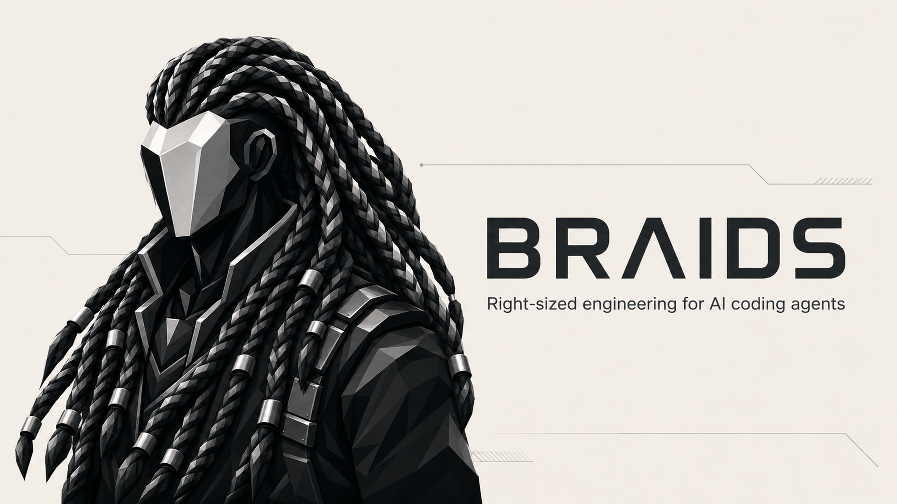

<p align="center">
  
</p>

<h1 align="center">Braids</h1>

<p align="center">
  Adaptive engineering governance for AI coding agents.<br>
  <strong>Enough engineering for the real risk—no more, no less.</strong>
</p>

<p align="center">
  <a href="LICENSE"></a>
  <a href="https://github.com/vyas-devgna/braids/actions/workflows/ci.yml"></a>
  
</p>

Braids helps coding agents choose the lowest total lifecycle burden that still satisfies the real requirements, quality scenarios, hard constraints, and acceptable residual risk. It rejects both under-engineering and architecture-for-show.

> Complexity is a cost. Require it to purchase scenario-linked value. “No change” is a valid result.

## Why Braids

| Ordinary agent tendency | Braids response |
|---|---|
| Treat every task as roughly equal | Routes work from **D0** local/mechanical to **D4** critical/irreversible |
| Optimize before finding a bottleneck | Requires a target and suitable evidence |
| Change the named file and miss callers | Expands context only when the change surface demands it |
| Add dependencies as shortcuts | Prices security, maintenance, transitives, portability, and exit cost |
| Call passing tests “production-ready” | Maps each material claim to the evidence that can prove it |
| Keep polishing after the task is solved | Stops when further work costs more than its expected value |

Braids is a portable [Agent Skill](skills/braids/SKILL.md), not a prompt demo or remote service. It has no runtime dependency, mandatory MCP server, production telemetry, or hidden project state.

## Install

### Claude Code

```sh
claude plugin marketplace add vyas-devgna/braids
claude plugin install braids@braids
```

Verify with `claude plugin details braids`.

### Codex CLI and desktop

```sh
codex plugin marketplace add https://github.com/vyas-devgna/braids
codex plugin add braids@braids --json
```

The Codex IDE extension does not load installable plugins. For the IDE, copy `skills/braids` to `<project>/.agents/skills/braids`.

### Cursor

```sh
git clone https://github.com/vyas-devgna/braids ~/.cursor/plugins/local/braids
```

### Any other Agent Skills host

```sh
npx braids-skill <host>          # opencode, cline, windsurf, copilot, antigravity, agents
npx braids-skill opencode --user # install for you rather than this project
npx braids-skill opencode --uninstall
```

`npx braids-skill` copies the skills into that host's documented skill directory. Run it with no host to see the list. Host-specific commands, limitations, and acceptance evidence live under [`adapters/`](adapters/).

## Use

Braids selects itself on work involving architecture, security, auth, data integrity, failure handling, concurrency, performance, dependencies, deployment, cross-module impact, or evidence-sensitive claims. You can also call it directly.

| Skill | Slash command | Use it for |
|---|---|---|
| `braids` | `/braids` | The method. Right-sizes any change and holds claims to evidence. |
| `braids-review` | `/braids-review` | A diff, branch, or PR: what breaks, what is unproven, what costs more than it buys. On Claude Code, name it — the built-in `code-review` skill wins generic "review this" phrasing. |
| `braids-audit` | `/braids-audit` | A whole repository: ranked engineering-risk surface when there is no diff. |
| `braids-risk` | `/braids-risk` | Adversarial pre-mortem: assume it shipped and caused an incident. |
| `braids-claims` | `/braids-claims` | Claim ledger: every "faster" or "secure" mapped to the evidence for it. |
| `braids-depth` | `/braids-depth` | Set the implementation threshold, or ask why a task got its depth. |
| `braids-help` | `/braids-help` | Reference card. |

### How hard should it work?

Two dials. **Depth** (D0–D4) is routed from risk automatically. **Threshold** is yours:

```text
braids low     smallest change that works, obvious check only
braids high    production shape: failure paths, callers, regression tests  (default)
braids ultra   hostile cases too: partial failure, retry, concurrency, upgrade,
               scale, corrupt state, outage — plus evidence for every claim
```

Threshold caps effort; risk sets the floor on care. `low` is honoured without a lecture — except where the change would weaken security, authorization, privacy, data integrity, a destructive or irreversible operation, or a compatibility guarantee. There Braids names in one sentence what `low` would skip and does the smallest safe version. Threshold never changes what may be *claimed*: unverified stays unverified at every level.

```text
Use Braids to review this migration plan and identify the smallest justified design.
braids ultra — I am about to change how sessions are authorized.
braids low — just make this test pass, don't redesign anything.
```

### Cost

Braids loads only the references a task routes to. Claude Code 2.1.248 measures **~778 tokens always-on** across all seven skills and **~3.1k when the core skill fires**. Individual skills cost ~60–90 always-on and 0.7–1.2k on invoke.

## Engineering depth

| Depth | Typical work | Default treatment |
|---|---|---|
| D0 | Safe, local, reversible | Direct change; no research or delegation |
| D1 | Routine bounded change | Targeted context and checks |
| D2 | Cross-module or platform-sensitive | Explicit change-surface model and broader verification |
| D3 | Security, reliability, concurrency, measured performance | Threat/failure analysis and stronger evidence |
| D4 | Irreversible, mission-critical, hard to recover | Staged decision, migration, rollback, recovery |

## Status

Braids is usable today but remains **experimental**. It is advisory on every host: it reasons about unsafe changes but ships no hooks and enforces nothing.

Four-case activation controls on the current description observed 3/3 expected activations and 1/1 expected dormancy on **both** Claude Code 2.1.248 and Codex 0.150.1. Depth routing is the weaker half — on Claude two of four cases read one level *below* the expected depth, which errs toward less engineering than the case deserves. The complete 92-case behavioural suite is not yet graded, and the six skills added alongside the core have no graded runs at all.

Read the exact boundaries in [Known Limitations](docs/29_KNOWN_LIMITATIONS.md). A present adapter is not itself a support claim.

## Validate and develop

```sh
python3 scripts/validate.py
python3 scripts/run_evals.py --fixture-tests
python3 scripts/measure_budget.py
python3 -m unittest discover -s tests
python3 scripts/build_adapters.py --dist dist
```

The repository contains 92 evaluation cases, eight fixture families, Draft 2020-12 contracts, and eight thin host adapters generated from one semantic source of truth.

## Documentation

- [Skills reference](docs/30_SKILLS_REFERENCE.md) — what each skill does and what it costs
- [Distribution](docs/31_DISTRIBUTION.md) — installing, releasing, and why Braids is not in a marketplace yet
- [Documentation map](docs/00_INDEX.md)
- [Product requirements](docs/03_PRODUCT_REQUIREMENTS_PRD.md)
- [Architecture](docs/04_ARCHITECTURE_FREEZE.md)
- [Security threat model](docs/10_SECURITY_THREAT_MODEL.md)
- [Evaluation strategy](docs/12_EVALUATION_STRATEGY.md)
- [Requirements traceability](docs/28_REQUIREMENTS_TRACEABILITY_MATRIX.md)
- [Known limitations](docs/29_KNOWN_LIMITATIONS.md)
- [Host research](research/00_INDEX.md)

## Contributing and security

Contributions are welcome; read [CONTRIBUTING.md](CONTRIBUTING.md) before changing normative behavior. Report vulnerabilities privately through GitHub’s security advisory flow as described in [SECURITY.md](SECURITY.md).

Brand artwork and usage notes live in [`assets/`](assets/README.md). No runtime behavior depends on them.

## License

[MIT](LICENSE) © 2026 Vyas Devgna.
