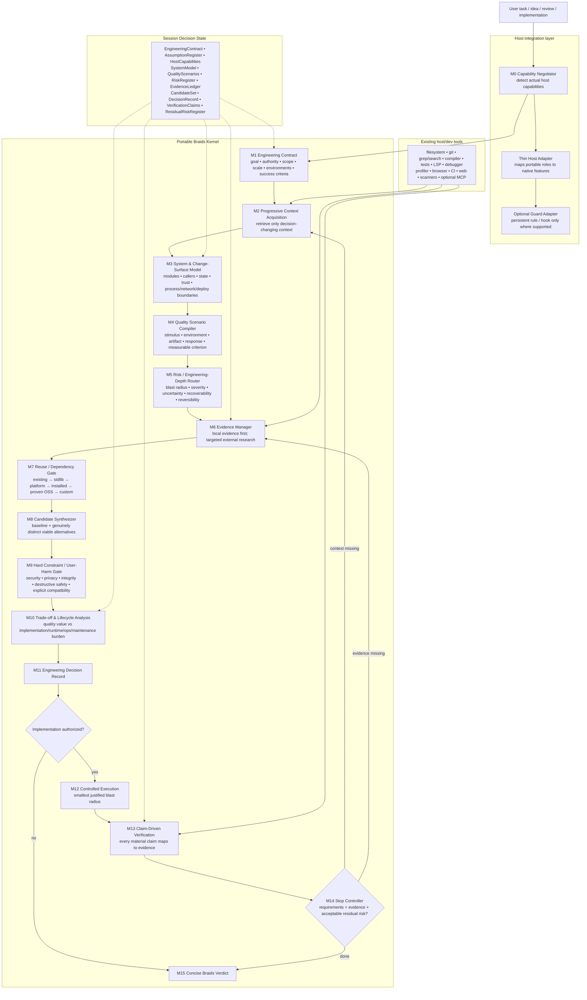
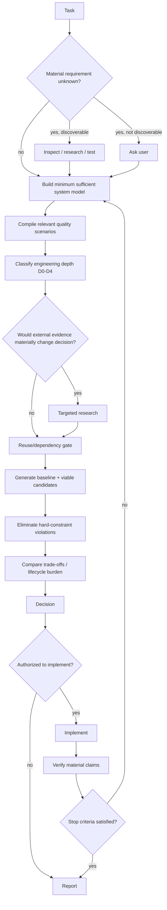

# Architecture Freeze — Braids v3

## Architecture decision

Braids will use a **host-neutral adaptive engineering kernel + ports/adapters integration architecture**.

<!-- diagram:01-braids-system-architecture -->

## Layer 1 — Portable methodology

Delivered as Agent Skills-compatible content:
- compact `SKILL.md`;
- focused `references/`;
- deterministic helper `scripts/` only where they outperform LLM reasoning;
- optional `assets/` only for output templates.

The kernel has no hard dependency on MCP, hooks, subagents, LSP, web access or a server.

## Layer 2 — Capability abstraction

Before using optional behaviors, Braids establishes `HostCapabilities`.

Capabilities are semantic:
- persistent instruction available?
- hook interception available?
- shell?
- write access?
- web?
- LSP?
- isolated subagent?
- worktree/sandbox?
- policy/approval controls?

No core decision is written as `if host == Cursor`.

## Layer 3 — Host adapters

Adapters map semantic capabilities to host-native surfaces:
- Claude Code plugin components;
- Codex plugin/skills/hooks/AGENTS/subagents;
- Cursor Agent Plugin or Cursor Plugin features;
- Antigravity Skill/Rule/Workflow/plugin;
- Copilot plugin components;
- Windsurf Skill/Rule/Workflow;
- OpenCode skill/agent/permissions;
- Cline skill/rules/hooks.

## Layer 4 — Optional deterministic tooling

Only added when justified:
- validation scripts;
- manifest builders;
- conformance checks;
- host adapter generation;
- possibly an MCP server in a later release if a concrete cross-host deterministic need emerges.

## Runtime lifecycle

<!-- diagram:03-runtime-decision-flow -->

1. Capability negotiation
2. Engineering contract
3. Progressive context acquisition
4. System/change-surface model
5. Quality scenarios
6. Risk/depth routing
7. Evidence/research
8. Reuse/dependency evaluation
9. Candidate generation
10. Hard constraints
11. Trade-offs/lifecycle burden
12. Decision record
13. authorization
14. controlled execution
15. claim-driven verification
16. stop controller
17. concise verdict

## Engineering depth

D0: trivial/local/reversible.
D1: routine bounded engineering.
D2: cross-module/platform-sensitive.
D3: security/data/performance/reliability/high-consequence.
D4: large-scale/irreversible/mission-critical.

Depth determines analysis/research/verification intensity, not line count.

## Architectural invariants

- No silent material assumptions.
- No external research without decision value.
- No dependency without adoption cost analysis when material.
- No claim of "faster", "safer", "compatible", "robust", etc. without corresponding evidence class.
- No automatic scope expansion.
- No deterministic safety claim without deterministic host enforcement.
- No mandatory persistence.
- No recursive self-improvement loop without authorization and a stop condition.
- Existing solution may be the correct answer; Braids must be able to recommend no change.

## Why this architecture is frozen

It matches the current ecosystem split: Agent Skills are broadly portable, while hooks/rules/agents/LSP remain host-specific. Agent Plugins v1 explicitly preserves that boundary. This architecture therefore minimizes duplication and survives host API churn better than separate implementations.
