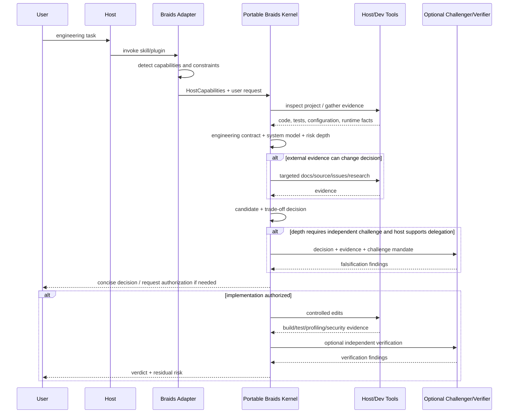

# Host Platform Integration Specification

## Integration doctrine

The portable kernel is authoritative. Adapters may add capability but must not redefine Braids' engineering philosophy.

<!-- diagram:02-host-adapter-sequence -->

## Capability classes

P0 Instruction only: reasoning/reporting.
P1 Persistent guidance: project/user/org rule can trigger Braids.
P2 Tool-assisted: repo search, shell, tests, web, LSP, profiling.
P3 Deterministic interception: hooks/policy can block or modify selected operations.
P4 Delegation/isolation: independent subagents/worktrees/sandboxes.
P5 Managed governance: organization-controlled policy, audit/distribution.

## Claude Code

Use:
- plugin packaging for community/team distribution;
- `skills/` for Braids core;
- optional `agents/` for Scout/Challenger/Verifier;
- optional hooks for deterministic policy;
- native LSP plugin mechanisms if already present;
- local `--plugin-dir`/reload during development.

Do not:
- require Claude-specific frontmatter in the portable source of truth;
- rely on plugin-root CLAUDE.md for core context;
- assume plugin subagents can carry all security configuration.

## Codex

Use:
- Agent Skill as canonical workflow;
- plugin packaging for installable distribution;
- scoped AGENTS.md only for optional Guard Mode;
- hooks as supplementary interception, not sole security boundary;
- subagents/worktrees only for higher-depth independent exploration/verification.

Do not:
- keep full Braids methodology in AGENTS.md;
- spawn write-heavy subagents by default.

## Cursor

Preferred baseline:
- Agent Plugin format for portable skill.

Enhanced Cursor adapter:
- `.cursor-plugin/plugin.json`;
- optional rules, agents, commands, hooks;
- team marketplace compatibility.

Do not require enhanced format for Braids' basic behavior.

## Google Antigravity

Use:
- workspace/global Agent Skill;
- optional small Rule for Guard Mode;
- Workflow only for explicitly user-invoked deterministic sequences, not automatic Braids reasoning.

Reason: Rules are persistent/model-decided; Workflows are explicit trajectory scripts; Skills provide the on-demand capability model Braids needs.

## GitHub Copilot

Use:
- skills as core;
- optional plugin components for agents/hooks/LSP/MCP where supported;
- repository-level policy for team governance only when required.

Account for CLI/cloud execution differences in conformance testing.

## Windsurf

Use:
- Cascade Skill for core;
- small Rule for optional Guard Mode;
- Workflow only for manual user-requested procedural operations.

## OpenCode

Use:
- Agent Skill paths supported by OpenCode;
- permissions to bound skill/tools where desired;
- custom subagents only when depth justifies independent review.

## Cline

Use:
- skill for core;
- project/global skill scopes;
- optional PreToolUse and lifecycle hooks for deterministic guards;
- PreCompact can preserve a concise Braids decision state if long sessions require compaction resilience.

## Generic host

Minimum support:
- install/copy Agent Skill;
- manual invocation if implicit triggering is absent.

Expected behavior degrades gracefully to advisory P0/P1.

## Adapter contract

Every adapter must expose:
- adapter version;
- detected host version when available;
- supported capability set;
- unsupported capability set;
- enforcement coverage statement;
- installation/uninstallation path;
- conformance-test command/instructions.

No adapter may silently claim functionality not verified on its host.
