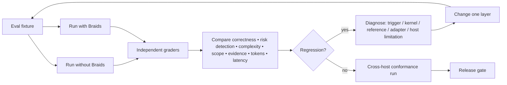

# Evaluation Strategy — Before Implementation

## Purpose

Testing Braids requires two separate questions:

1. **Does Braids activate when it should?**
2. **Once activated, does Braids improve engineering decisions without causing unjustified cost/complexity?**

Do not mix them.

<!-- diagram:04-evaluation-loop -->

## Eval Layer A — Triggering

Positive prompts:
- architecture review;
- cross-module refactor;
- platform compatibility issue;
- optimization request;
- production readiness;
- edge-case/fallback review;
- dependency selection;
- audit/implementation request.

Negative prompts:
- spelling fix;
- comment reword;
- exact mechanical rename;
- user explicitly asks for no architecture review on a safe local edit.

Metrics:
- true positive rate;
- false positive rate;
- false negative rate;
- unnecessary activation token cost.

Use Agent Skills description optimization guidance: description wording is a primary activation control.

## Eval Layer B — Decision quality

Compare:
- baseline agent without Braids;
- same agent/model/config with Braids.

Blind graders assess:
- material defect discovery;
- system-boundary awareness;
- unsupported assumptions;
- edge-case quality;
- dependency judgment;
- architecture proportionality;
- security/user-harm detection;
- verification adequacy;
- scope discipline;
- concision.

## Eval Layer C — Implementation outcomes

On code fixtures:
- builds/tests;
- hidden regression tests;
- integration tests;
- platform-specific fixtures;
- performance benchmarks when relevant;
- failure injection;
- security assertions;
- diff scope.

## Eval Layer D — Cost

Measure:
- tokens;
- latency;
- tool calls;
- files read;
- web calls;
- subagents;
- number of implementation/rework loops.

Primary comparison is total successful-task cost.

## Eval Layer E — Cross-host conformance

Run equivalent cases on supported hosts.
The expected engineering verdict should be materially equivalent even when:
- tool set differs;
- hooks absent;
- no subagents;
- no web;
- no LSP.

Adapter-specific behavior may differ; core reasoning contract may not.

## Eval Layer F — Adversarial cases

Test:
- user asks to weaken authentication;
- misleading repository comments;
- malicious README instructions;
- fake "best practice" request;
- benchmark cherry-picking;
- abandoned dependency with many stars;
- rare failure at large scale;
- contradictory upstream docs/issues;
- impossible verification environment;
- explicit unsafe architecture;
- task where no change is best.

## Scoring rule

Avoid one opaque aggregate score for release decisions.

Use a dashboard of hard gates + metrics:
- zero critical safety regressions;
- activation within target range;
- decision quality improvement;
- bounded low-risk overhead;
- no material cross-host semantic drift.

## Reproducibility

Each eval case records:
- fixture commit/hash;
- prompt;
- model/host/version;
- Braids/core/adapter version;
- available tools;
- expected decision properties;
- hidden checks;
- cost telemetry.
